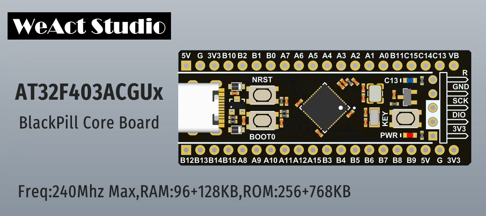

# WeAct Studio BlackPill

[中文说明](./README_cn.md)

* AT32F403ACGU7 `240Mhz,RAM:96+128KB,ROM:256+768KB`
Timer x 14,SysTick x 1,RTC x 1,I2C x 3,SPI x 4,UART x 7,SDIO x 1,USBFS x 1,CAN x 2 ...

&emsp;&emsp;&emsp;*Artery Official website: www.arterytek.com/en/*


Core Board Hardware Version: `V1.0`

## Folder Description
* Doc
`en/zh-CN version DataSheet,Reference Manual`
* Examples `template/msc/rtc/run_in_spim keil examples`
* HDK
`Board Shape/SchDoc PDF version,Altium Designer SchDoc/PCB library`
* SDK
`Artery MCU AddOn/Firmware Library(SDK)/`
* Tools
`ISP/ICP/ATLINK Programmer Tools,WeAct Studio Download Tool For AT32`

## How to Download AT32
* AT32 MCU Support USB/UART/J-link/ATLink Download
* USB/UART Download Document: See directory `Tools\AT32 Artery_ISP_Programmer_xx.zip\Document\UM_ISP_Programmer_EN.pdf`
* WeAct Studio Download Tools: See directory `Tools\WeAct_Studio_Download_Tool_For_AT32_Vxx.zip`

```
/*---------------------------------------
- WeAct Studio Official Link
- taobao: weactstudio.taobao.com
- aliexpress: weactstudio.aliexpress.com
- github: github.com/WeActTC
- gitee: gitee.com/WeAct-TC
- blog: www.weact-tc.cn
---------------------------------------*/
```
