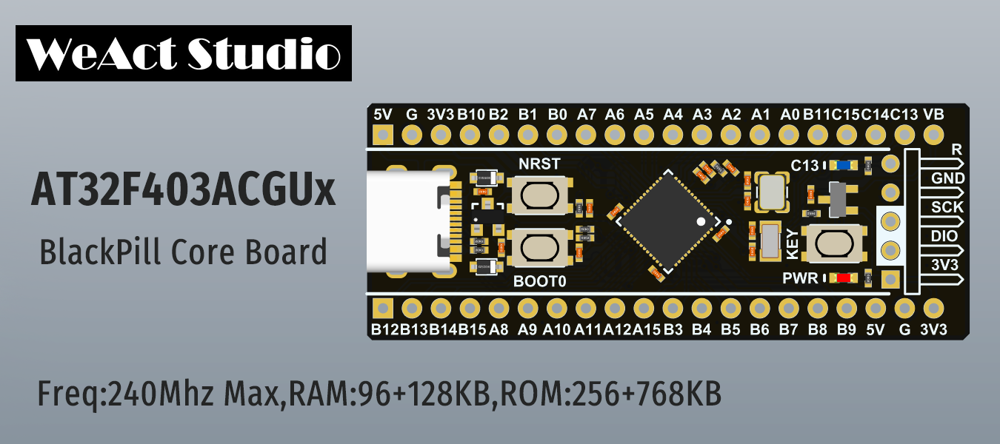

# WeAct Studio BlackPill
* AT32F403ACGU7 `240Mhz,RAM:96+128KB,ROM:256+768KB`
Timer x 14,SysTick x 1,RTC x 1,I2C x 3,SPI x 4,UART x 7,SDIO x 1,USBFS x 1,CAN x 2 ...

&emsp;&emsp;&emsp;*雅特力官方网址: www.arterytek.com/cn/*


当前核心板硬件版本: `V1.0`

## 文件夹说明
* Doc
`中英文版本数据手册，参考手册，勘误手册等`
* Examples
`template/msc/rtc/run_in_spim keil 例程`
* HDK
`板子外形/原理图PDF版本，Altium Designer核心板封装`
* SDK
`雅特力官方开发环境AddOn支持包/固件例程库(SDK)`
* Tools
`ISP/ICP/ATLINK 编程工具，WeAct Studio Download Tool For AT32`

## AT32如何烧录程序
* AT32 MCU 支持 USB/UART/J-link/ATLink 烧录
* USB/UART 烧录文档&&工具: 见目录 `Tools\AT32 Artery_ISP_Programmer_xx.zip\Document\UM_ISP_Programmer_EN.pdf`
* WeAct Studio 一键烧录工具: 见目录 `Tools\WeAct_Studio_Download_Tool_For_AT32_Vxx.zip`

```
/*---------------------------------------
- WeAct Studio 官方链接
- taobao: weactstudio.taobao.com
- aliexpress: weactstudio.aliexpress.com
- github: github.com/WeActTC
- gitee: gitee.com/WeAct-TC
- blog: www.weact-tc.cn
---------------------------------------*/
```
